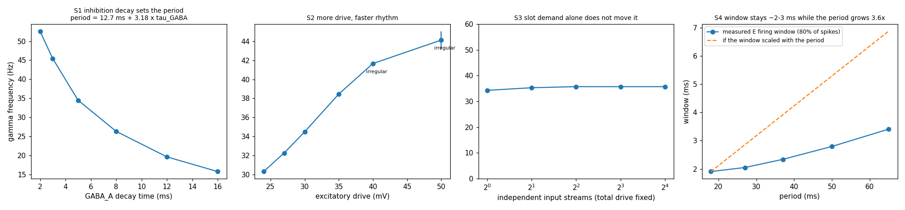

# FrequencyAndNeurons

**What sets the frequency of a gamma rhythm: the neurons' own time constants, or how many phase slots the computation needs?**

A small, closed question from the KolmeOvea line. It is answered with an emergent gamma network that has no pacemaker, and it is now parked in the lineage.

## The question

In KolmeOvea, the basket-cell rhythm opened *phase windows* in which input was admitted. That raised a tempting idea: if a circuit has to multiplex N streams, the time needed to separate their phase slots should set the frequency, T ≥ N × (slot + reset). On that idea, two ~12 ms slots would make ~40 Hz, and seven gamma slots would make a theta cycle.

The mainstream view runs the other way: the excitation–inhibition loop's time constants set the period, and slots are whatever fits inside it. This repo builds the loop and tests both directions.

## The model

- **The rhythm is emergent (PING).** 400 excitatory leaky integrate-and-fire (LIF) cells drive 100 fast-spiking basket cells, which inhibit them back through GABA_A synapses. There is no pacemaker: the rhythm is whatever this loop does.
- **Frequency is measured from basket-cell volleys** (the median inter-volley interval). The spectral peak is used only to check oscillation quality, because it sometimes locks onto a harmonic.
- **The "slot" is measured model-free:** the shortest arc of the cycle that contains 80% of all excitatory spikes.

Run `python fan.py` (numpy only, about 2 minutes), then `python make_figure.py`.

## Results (`results.json`, 3 seeds per point)

| sweep | result |
|---|---|
| **S1: GABA_A decay time**, 2 → 16 ms | 52.6 → 45.5 → 34.5 → 26.3 → 19.6 → 15.8 Hz. The period is almost exactly linear in the decay time: **period ≈ 12.7 ms + 3.18 × τ_GABA** |
| **S2: excitatory drive**, 24 → 50 | 30.3 → 44.1 Hz. The rhythm becomes irregular above ~40 (period CV 0.26–0.43) |
| **S3: 1 → 16 independent input streams, total drive fixed** | 34.3, 35.3, 35.7, 35.7, 35.7 Hz: **flat**. More streams only steady the rhythm, because a single stream makes the whole network's drive fluctuate together |
| **S4: firing window vs period** | The period grows **3.6×** (18 → 65 ms). The window grows only **1.8×** (1.9 → 3.4 ms), shrinking from 11% to 5% of the cycle |

## What it means

**1. Frequency comes from the loop's physics, not from slot demand.**
- Slower inhibition gives a slower rhythm (linear in period), and more drive gives a faster one.
- Splitting the same drive across 16 streams changes nothing, because nothing in a local E–I loop senses how many slots are needed. The loop integrates total current, and that is all.

**2. The window is cut off by the loop itself, and slower inhibition buys dead time.**
- Excitatory cells fire only until the basket volley they trigger comes back and shuts them down, which takes a few milliseconds.
- Slowing GABA_A decay lengthens the silent recovery part of the cycle, not the firing window. A slower gamma cannot hold a wider "token"; it just publishes the same narrow one less often.
- The fitted period (a fixed ~13 ms of transmission plus ~3.2 ms for every millisecond of inhibition decay) is this asymmetry in numbers.

**3. The windows match real cortex, not the 10–12 ms slot story.** In the V2→V4 microstimulation experiment (Drebitz et al. 2025), V4 gamma ran at ~73.5 Hz, a period of ~13.6 ms. The effective input window was about ±45° around the excitability peak, roughly 3.4 ms. Windows of a few milliseconds are what the loop produces here too.

**4. Where "demand sets the rhythm" can still live: the slow carrier.**
- In the theta–gamma code (Lisman & Idiart 1995; Lisman & Jensen 2013), capacity is the number of gamma cycles per theta cycle. Human hippocampal recordings show that higher working-memory load goes with slower theta (Axmacher et al. 2010).
- If load reshapes rhythm anywhere, it is by stretching the slow cycle, not by retuning the local gamma loop. That needs a load-sensing mechanism this repo does not contain, and the result here says it would have to be *added*: the gamma loop cannot do it on its own.

## Place in the lineage

- **KolmeOvea**: three control surfaces on one pyramidal cell (apical tuft / basket rhythm / chandelier AIS). There, the basket rhythm was imposed by a pacemaker, and its 32% open window came from the chosen parameters.
- **KolmeOvea, trained follow-up**: trained networks used the basket door only when nothing else had access to phase, and learned phase tagging rather than attention unless context could reach the soma no other way.
- **FrequencyAndNeurons (this repo)**: makes the rhythm emergent and settles the side question the windows raised. The windows are consequences of loop physics, not the thing that sets the clock.

## Ledger

- **Pure PING with mean-field, all-to-all coupling.** There is no spatial structure, no E→E recurrence and no I→I synapses. Interneuron-only (ING) and mixed regimes can scale differently.
- **The absolute frequencies (16–53 Hz) belong to these parameters.** The scaling laws are the result.
- **The single-ping admission curve (`ping_curve`) is noisy,** with ~50 pings per phase bin. The window claim rests on the spike-phase arc, which uses every spike.
- **This concerns PING gamma only.** Theta, and gamma produced by other mechanisms, are outside what was tested.
- **The papers below were read for mechanism and numbers, not replicated.** The two Liu & Sun papers are simulations of one reconstructed basket cell. They also state opposite spatial preferences: the 2023 paper found a preference for dispersed input, while the 2024 paper describes it as clustered.

## Papers

The papers read for this line (open access where marked with a DOI):

- **Drebitz, E., Rausch, L.-P. & Kreiter, A. K. (2025).** Gamma-band synchronization between neurons in the visual cortex is causal for effective information processing and behavior. *Nature Communications* 16:7380. [doi:10.1038/s41467-025-62732-8](https://doi.org/10.1038/s41467-025-62732-8) — a single V2 volley perturbs V4 and behavior only when it arrives near the V4 γ-excitability peak.
- **Liu, M. & Sun, X. (2024).** Temporal integration on the dendrites of fast-spiking basket cells. *Scientific Reports* 14:30278. [doi:10.1038/s41598-024-81655-w](https://doi.org/10.1038/s41598-024-81655-w) — in a compartmental model, synchronous inputs within ≤10 ms trigger basket cells most efficiently, and Kv3 and N-type Ca²⁺ channels shape the integration window.
- **Liu, M. & Sun, X. (2023).** Spatial integration of dendrites in fast-spiking basket cells. *Frontiers in Neuroscience* 17:1132980. [doi:10.3389/fnins.2023.1132980](https://doi.org/10.3389/fnins.2023.1132980) — supralinear and sublinear dendrites; cp-AMPA receptors are needed for fast dendritic spikes.
- **Qi, Y. et al. (2024).** Specific and plastic: chandelier cell-to-axon initial segment connections in shaping functional cortical network. *Neuroscience Bulletin* 40(11):1774–1788. [doi:10.1007/s12264-024-01266-3](https://doi.org/10.1007/s12264-024-01266-3) — the chandelier/AIS review behind KolmeOvea's third door.
- **Norman-Haignere, S. V. et al. (2025).** Temporal integration in human auditory cortex is predominantly yoked to absolute time. *Nature Neuroscience*. [doi:10.1038/s41593-025-02060-8](https://doi.org/10.1038/s41593-025-02060-8) — cortical integration windows follow a fixed clock, not speech structure.

Background on what sets gamma frequency and on theta–gamma capacity:

- Whittington, M. A., Traub, R. D. & Jefferys, J. G. R. (1995). Synchronized oscillations in interneuron networks driven by metabotropic glutamate receptor activation. *Nature* 373, 612–615 — gamma frequency depends on the decay of inhibition.
- Börgers, C. & Kopell, N. (2003). Synchronization in networks of excitatory and inhibitory neurons with sparse, random connectivity. *Neural Computation* 15, 509–538 — PING theory.
- Buzsáki, G. & Wang, X.-J. (2012). Mechanisms of gamma oscillations. *Annual Review of Neuroscience* 35, 203–225 — review.
- Ray, S. & Maunsell, J. H. R. (2010). Differences in gamma frequencies across visual cortex restrict their possible use in computation. *Neuron* 67, 885–896 — gamma frequency rises with stimulus contrast.
- Lisman, J. E. & Idiart, M. A. P. (1995). Storage of 7 ± 2 short-term memories in oscillatory subcycles. *Science* 267, 1512–1515.
- Lisman, J. E. & Jensen, O. (2013). The theta-gamma neural code. *Neuron* 77, 1002–1016.
- Axmacher, N. et al. (2010). Cross-frequency coupling supports multi-item working memory in the human hippocampus. *PNAS* 107, 3228–3233 — higher memory load goes with slower theta.
